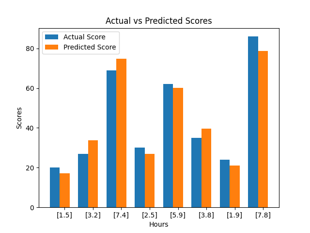

# Score_Prediction_using_SupervisedML
The score of student is predicted from the number of hours studies using Linear Regression Model.

<b>Aim :</b> Predict the percentage of a student based on the no. of study hours.

<b>Dataset :</b> Data can be found at http://bit.ly/w-data

What will be predicted score if a student studies for 9.25 hrs/day?

## Supervised Machine Learning
Supervised learning deals with or learns with "labeled" data. In simple terms, it learns from presentable examples. Supervised learning classified into two categories of algorithms:

<b>Classification :</b> A classification problem is when the output variable is a category, such as "positive" and "negative" or "mask" and "no mask". It is discrete in nature. <br>
<b>Regression :</b> A regression problem is when the output variable is a real value, such as "rupees","weight" or "scores". It is continuous in nature.

## Linear Regression
Linear regression is probably one of the most important and widely used regression techniques. It’s among the simplest regression methods. One of its main advantages is the ease of interpreting results.

Linear regression is a statistical approach for modelling relationship between a dependent variable with a given set of independent variables.

It is assumed that the two variables are linearly related. Hence, we try to find a linear function that predicts the response value(y) as accurately as possible as a function of the feature or independent variable(x).

Let's define,<br>
x as feature vector, i.e x = [x<sub>1</sub>, x<sub>2</sub>, ..., x<sub>n</sub>],<br>
y as response vector, i.e y = [y<sub>1</sub>, y<sub>2</sub>, ..., y<sub>n</sub>]

Now, the task is to find a line which fits best in above scatter plot so that we can predict the response for any new feature values. (i.e a value of x not present in dataset). This line is called regression line.

The equation of regression line is represented as:<br>
<b>h(x<sub>i</sub>) = β<sub>0</sub> + β<sub>1</sub>x<sub>i</sub></b>

The linear equation assigns one scale factor to each input value or column, called a coefficient and represented by the capital Greek letter Beta (β). One additional coefficient is also added, giving the line an additional degree of freedom (e.g. moving up and down on a two-dimensional plot) and is often called the intercept or the bias coefficient.

## Libraries
NumPy to perform the multi-dimensional operation.

Pandas is a fast, powerful, flexible and easy to use open source data analysis and manipulation tool.

Seaborn and Matplotlib used for plotting and vizualization of data.

Scikit is used for splitting dataset into training and testing, predicting a continuous-valued attribute associated with an object and also evaluation of trained model.

```
# Importing all the important Libraries
import numpy as np
import pandas as pd
import math
import seaborn as sns
import matplotlib.pyplot as plt
from sklearn.model_selection import train_test_split
from sklearn.linear_model import LinearRegression
from sklearn.metrics import mean_squared_error, mean_absolute_error, r2_score
%matplotlib inline
```

## Loading Dataset
The dataset is available at http://bit.ly/w-data.

The dataset consists of 25 records with 2 columns as 'Hours' representing the number of hours studied per day and 'Scores' representing the scores obtained by student.

```
# Loading Dataset
df = pd.read_csv('http://bit.ly/w-data')
print('Shape:', df.shape)
df.head()
```

```
# Vizualizing Data
df.plot(x='Hours', y='Scores', style='o')
plt.title('Hours vs Percentage')
plt.xlabel('Hours Studied')
plt.ylabel('Percentage Score')
plt.show()
plt.savefig('datasetVizualization.png')
```


## Preparing the data
Here, we store the values of attribute 'Hours' in X and label 'Scores' in y.

```
# Dividing the dataset columns. 
# Hours in X and Scores in y
X = df.iloc[:, :-1].values    
y = df.iloc[:, 1].values
```

## Splitting Datset
The split of data into the training and test sets is very important. We use Scikit Learn's built-in method of train_test_split() from model_selection.

The test size is kept 0.3 which indicates that 70% of data is used for training and remaining 30% of data is used for testing purpose.

```
# Split Data into training and testing
X_train, X_test, y_train, y_test = train_test_split(X, y, test_size=0.3, random_state=0)
```

## Linear Regression Model
LinearRegression fits a linear model with coefficients w = (w1, …, wp) to minimize the residual sum of squares between the observed targets in the dataset, and the targets predicted by the linear approximation.

With Scikit-Learn it is extremely straight forward to implement linear regression models, as all you really need to do is import the LinearRegression class, instantiate it, and call the fit() method along with our training data.

```
# Linear Regression Model
lr = LinearRegression()    
lr.fit(X_train, y_train)
print('Linear Regression Model Trained Successfully!')
```

## Plotting a Regression Line
Using line equation, <b>h(x<sub>i</sub>) = β<sub>0</sub> + β<sub>1</sub>x<sub>i</sub></b> <br>
regression_line = LinearRegression().coef_*X + LinearRegression().intercept_

coef_ : array of shape (n_features, ) or (n_targets, n_features) <br>
It is used to estimate the coefficients for the linear regression problem. It would be a 2D array of shape (n_targets, n_features) if multiple targets are passed during fit. Ex. (y 2D). On the other hand, it would be a 1D array of length (n_features) if only one target is passed during fit.

intercept_ : float or array of shape (n_targets,) <br>
Independent term in the linear model. Set to 0.0 if fit_intercept = False.

The value β1 = 9.9106 (approximately) means that the predicted response rises by 9.9106 when 𝑥 is increased by one. <br>
The value β0 = 2.0181 (approximately) illustrates that the model predicts the response 2.0181 when 𝑥 is zero.

```
# Getting B0 and B1
print('coef_ :', lr.coef_)
print('intercept_ :', lr.intercept_)
```

```
# Plotting a Regression Line
regression_line = lr.coef_* X + lr.intercept_
plt.scatter(X, y)
plt.title('Hours vs Percentage')
plt.xlabel('Hours Studied')
plt.ylabel('Percentage Score')
plt.plot(X, regression_line, color='orange')
plt.show()
plt.savefig('regressionLine.png')
```


## Prediction
Using the trained Linear Regression Model to predict scores for test data and compare the results.

```
# Prediction
y_pred = lr.predict(X_test)

# Actual Score vs Predicted Score
new_df = pd.DataFrame({'Actual Score': y_test, 
                       'Predicted Score': y_pred})
new_df
```

```
fig, ax = plt.subplots()
index = np.arange(len(X_test))
bar_width = 0.35
actual = plt.bar(index, new_df['Actual Score'], bar_width, label='Actual Score')

predicted = plt.bar(index + bar_width, new_df['Predicted Score'], bar_width, label='Predicted Score')

plt.xlabel('Hours')
plt.ylabel('Scores')
plt.title('Actual vs Predicted Scores')
plt.xticks(index + bar_width, X_test)
plt.legend()
plt.show()
plt.savefig('actualvspredicted.png')
```


## Model Evaluation
The final step is to evaluate the performance of algorithm.
Mean Absolute Error (MAE) is the mean of the absolute value of the errors. It is calculated as:<br>
mae.png

Mean Squared Error (MSE) is the mean of the squared errors and is calculated as:<br>
mse.png

Root Mean Squared Error (RMSE) is the square root of the mean of the squared errors:<br>
rmse.png

R2 Score is a statistical method that determines the goodness of fit.<br>
The high value of R-square determines the less difference between the predicted values and actual values and hence represents a good model.

```
# Model Evaluation
print('Mean Absolute Error MAE:', mean_absolute_error(y_test, y_pred))
print('\nMean Squared Error MSE:', mean_squared_error(y_test, y_pred))
print('\nRoot Mean Squared Error RMSE:', math.sqrt(mean_squared_error(y_test, y_pred)))
print('\nR2 Score:', r2_score(y_test, y_pred))
```

## Predicted score if a student studies for 9.25 hrs/day
```
# Predicted score if a student studies for 9.25 hrs/day
input_hours = input('Enter number of hours for predicting the score: ')
input_hours = float(input_hours)
hours = np.array([input_hours])
hours = hours.reshape(-1, 1)
pred_score = lr.predict(hours)
print("Number of Hours = ", input_hours, 'hours/day')
print("Predicted Score = {:.4}".format(pred_score[0]))
```

### Output
Enter number of hours for predicting the score: 9.25 <br>
Number of Hours = 9.25 hours/day<br>
Predicted Score = 92.92<br>

## Comaprison of various test sizes
<table>
  <tr>
    <th>Test No.</th>
    <th>Test Size</th>
    <th>MAE</th>
    <th>MSE</th>
    <th>RMSE</th>
    <th>R2 Score</th>
    <th>Predicted Score</th>
  </tr>
  <tr>
    <td>1</td>
    <td>0.2</td>
    <td>4.183859899002982</td>
    <td>21.598769307217456</td>
    <td>4.647447612100373</td>
    <td>0.9454906892105354</td>
    <td>93.69</td>
  </tr>
  <tr>
    <td>2</td>
    <td>0.25</td>
    <td>4.130879918502482</td>
    <td>20.33292367497996</td>
    <td>4.509204328368805</td>
    <td>0.9367661043365056</td>
    <td>93.89</td>
  </tr>
  <tr>
    <td>3</td>
    <td>0.3</td>
    <td>4.419727808027651</td>
    <td>22.965097212700428</td>
    <td>4.7921912746363144</td>
    <td>0.9568211104435257</td>
    <td>92.92</td>
  </tr>
  <tr>
    <td>4</td>
    <td>0.35</td>
    <td>4.691397441397446</td>
    <td>25.463280738222593</td>
    <td>5.046115410711748</td>
    <td>0.9555700801388128</td>
    <td>92.15</td>
  </tr>
  <tr>
    <td>5</td>
    <td>0.4</td>
    <td>4.8945108634106065</td>
    <td>26.034569687682232</td>
    <td>5.102408224327237</td>
    <td>0.956640847232559</td>
    <td>92.66</td>
  </tr>
</table>

## References
1. https://numpy.org/
2. https://pandas.pydata.org/
3. https://matplotlib.org/
4. https://seaborn.pydata.org/
5. https://scikit-learn.org/
